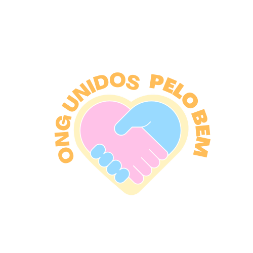

# 🌍 ONG Unidos Pelo Bem — SPA



> Projeto acadêmico desenvolvido por **Adrielly Proti de Oliveira Silva**  
> Curso: *Análise e Desenvolvimento de Sistemas – Cruzeiro do Sul EAD*

---

## 🧩 Sobre o projeto

A **ONG Unidos Pelo Bem** é um site desenvolvido como **Single Page Application (SPA)** em HTML5, CSS3 e JavaScript.  
O objetivo é demonstrar boas práticas de acessibilidade, responsividade, roteamento em hash (`#/rotas`) e design system modular, conforme as exigências da disciplina **Desenvolvimento Front-End**.

🔗 **Acesse o site publicado:**  
👉 [https://adriellyproti.github.io/ONG_Unidos_Pelo_Bem/#/home](https://adriellyproti.github.io/ONG_Unidos_Pelo_Bem/#/home)

---

## 🚀 Funcionalidades

- Navegação dinâmica sem recarregar a página (SPA com hash router)
- Layout 100% responsivo e acessível (HTML5 + CSS Grid + Flexbox)
- Sistema de rotas em JavaScript (`router.js`)
- Estrutura modular com pastas organizadas (`assets`, `pages`, etc.)
- Formulário com validação (via `validators.js`)
- Imagens otimizadas e semântica correta para SEO e acessibilidade
- Página 404 personalizada

---

## 🗂 Estrutura de diretórios

index.html
assets/
├── css/
│ └── styles.css
├── img/
│ ├── Capa.jpg
│ ├── LogoOngFaculdade.svg
│ ├── Projeto_Alimentação.jpg
│ ├── Projeto_Doação.jpg
│ ├── Projeto_Educação.jpg
│ └── Sobre_ONG.jpg
└── js/
├── app.js
├── router.js
└── validators.js

pages/
├── home.html
├── sobre.html
├── projetos.html
├── doacao.html
├── contato.html
└── 404.html

yaml
Copiar código

---

## 🧠 Tecnologias utilizadas

| Categoria | Ferramenta |
|------------|------------|
| Estrutura | **HTML5** |
| Estilo e Layout | **CSS3**, **Flexbox**, **Grid**, **Design System Modular** |
| Interatividade | **JavaScript (ES6)** |
| Organização | **VS Code**, **Git**, **GitHub Pages** |
| Deploy | **GitHub Pages** (branch `main`) |

---

## 💻 Executando localmente

1. Clone o repositório:
   ```bash
   git clone https://github.com/adriellyproti/ONG_Unidos_Pelo_Bem.git
Abra no VS Code

Instale a extensão Live Server

Clique em “Go Live”

Acesse no navegador:

perl
Copiar código
http://127.0.0.1:5500/#/home
⚠️ Abrir diretamente com duplo clique (file://) não funciona, pois o fetch() do router é bloqueado por segurança.

📱 Rotas do site
Rota	Descrição
#/home	Página inicial
#/sobre	Sobre a ONG
#/projetos	Projetos sociais
#/doacao	Página de doações
#/contato	Formulário de contato
#/404	Página de erro

🖼️ Capturas de tela
Página	Imagem
Início	
Projetos	

🧩 Autor
Adrielly Proti de Oliveira Silva
💻 Desenvolvedora em formação | 🌎 São Paulo, Brasil
📧 adriellyproti@hotmail.com

📄 Licença
Este projeto foi desenvolvido para fins acadêmicos e educacionais.
Sinta-se à vontade para estudar e adaptar o código.

✨ “Quando nos unimos, o bem floresce.”
